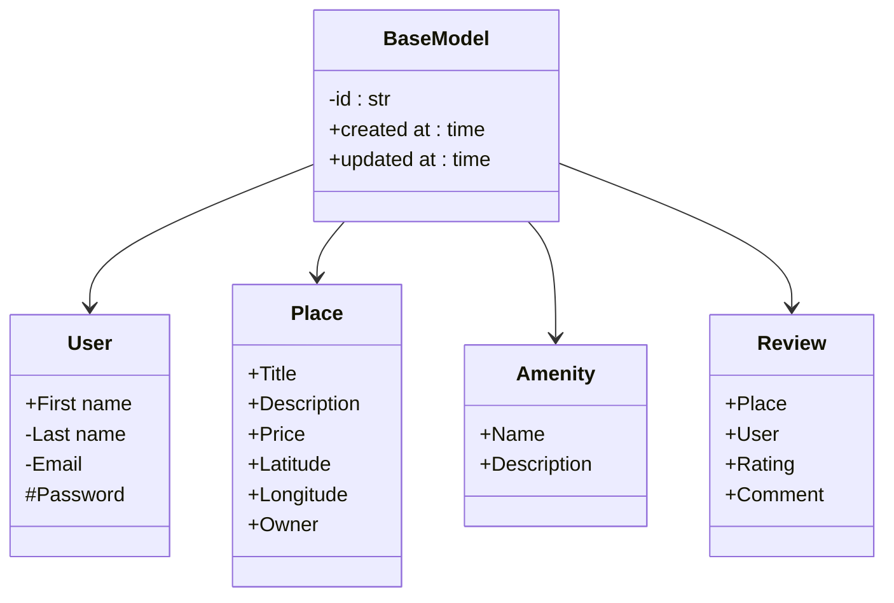

# holbertonschool-higher_level_programming

```mermaid
classDiagram
class BaseModel{
-id : str
+created at : time
+updated at : time
}
class User{
+First name
-Last name
-Email
#Password
}
class Place{
+Title
+Description
+Price
+Latitude
+Longitude
+Owner
}
class Amenity{
+Name
+Description
}
class Review{
+Place
+User
+Rating
+Comment
}

BaseModel --> User
BaseModel --> Place
BaseModel --> Amenity
BaseModel --> Review

```
