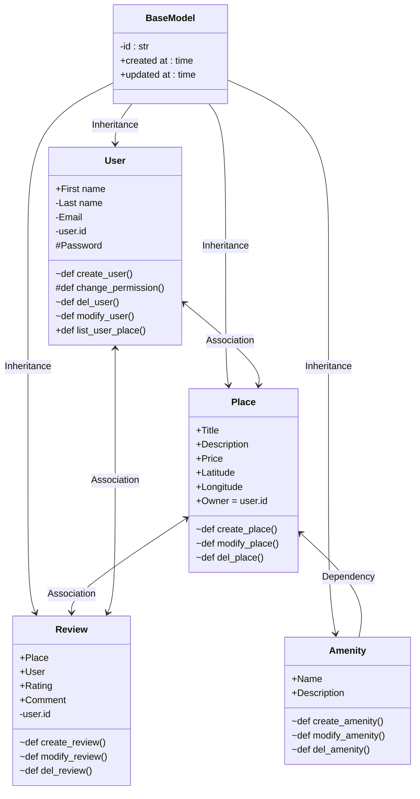

# holbertonschool-higher_level_programming

```mermaid
classDiagram
class BaseModel{
-id : str
+created at : time
+updated at : time
}
class User{
+First name
-Last name
-Email
-user.id
#Password
~def create_user()
#def change_permission()
~def del_user()
~def modify_user()
+def list_user_place()
}
class Place{
+Title
+Description
+Price
+Latitude
+Longitude
+Owner = user.id
~def create_place()
~def modify_place()
~def del_place()
}
class Amenity{
+Name
+Description
~def create_amenity()
~def modify_amenity()
~def del_amenity()
}
class Review{
+Place
+User
+Rating
+Comment
-user.id
~def create_review()
~def modify_review()
~def del_review()
}

BaseModel --> User : Inheritance
BaseModel --> Place : Inheritance
BaseModel --> Amenity : Inheritance
BaseModel --> Review : Inheritance
Place <-- Amenity : Dependency
Place <--> Review : Association
User <--> Review : Association
User <--> Place : Association
```
